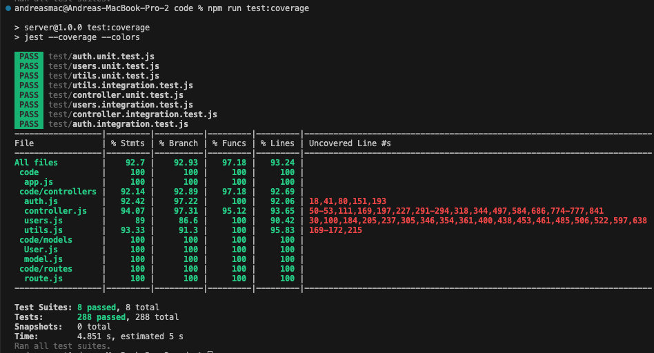

<link rel="stylesheet" type="text/css" media="all" href="./markdownStyle.css" />

# Test Report

<The goal of this document is to explain how the application was tested, detailing how the test cases were defined and what they cover>

# Contents

- [Test Report](#test-report)
- [Contents](#contents)
- [Dependency graph](#dependency-graph)
- [Integration approach](#integration-approach)
- [Tests](#tests)
- [Coverage](#coverage)
  - [Coverage of FR](#coverage-of-fr)
  - [Coverage white box](#coverage-white-box)

# Dependency graph

# Integration approach

In our project implementation, we have chosen to adopt a "Bottom-Up Integration" approach as our preferred integration strategy. This approach allows us to initially test the lower-level components, which serve as the foundational building blocks of the system, and gradually progress towards integrating the higher-level units.

Here is the sequence of steps we followed:

| Steps  | Object's argument                                                                                                                                                                                                                       |
| ------ | --------------------------------------------------------------------------------------------------------------------------------------------------------------------------------------------------------------------------------------- |
| Step 1 | We initiated the integration process by testing the functionality of the "Authentication" unit to ensure that the entire authentication system operates correctly.                                                                      |
| Step 2 | Subsequently, we proceeded to the "Utils" component, as it serves primarily as a support module for the entire system and its units.                                                                                                    |
| Step 3 | After confirming the functionality of the fundamental units, we conducted tests on the "Users" component to ensure proper management of system users, privileges, and gain a clear understanding of the system actors.                  |
| Step 4 | Finally, we concluded with the integration of the "Controller" unit, which represents the highest and most complex level. We deliberately addressed it last to resolve any issues that may have arisen from the other supporting units. |

Upon completing the aforementioned steps, we conducted Integration Tests of the APIs by utilizing the routes defined in "Route.js". These tests aimed to verify the seamless flow of requests and responses across the various integrated units and components, ensuring the end-to-end functionality of the system.

# Tests

<in the table below list the test cases defined For each test report the object tested, the test level (API, integration, unit) and the technique used to define the test case (BB/ eq partitioning, BB/ boundary, WB/ statement coverage, etc)> <split the table if needed>

| Test case name | Object(s) tested | Test level | Technique used |
| -------------- | ---------------- | ---------- | -------------- |
|                |                  |            |                |

# Coverage

## Coverage of FR

| Functional Requirements covered | Test(s) |
| ------------------------------- | ----------- |
| FR1 | |  
| FR11 |  "register" : "Registration - Done" / "Registration - Invalid Email" / "Registration - Already Registered" |
| FR12 | "LogIn" : "Login - Done" / "Login - Missing or Empty Field" / "Login - Not registered" / "Login - Wrong Credentials" |
| FR13 | "LogOut" : "Logout - Done" / "Logout - Already logged out" / "Logout - User not found - find" |
|FR14 |"Admin" = registerAdmin : "Register Admin - Done" / "Register Admin - Missing Information" / "Register Admin - Already Registered"|
|FR15 |"getUsers" : "GetUsers - Success with filled list" / "GetUsers - Success with empty list" / "GetUsers - Unauthorized" |
|FR16 | "getUser" :   1 - "Admin" : "GetUser - Success" / "GetUser - User not found"   2 - "Regular" : "GetUser - Success" / "GetUser - User not found" / "GetUser - Unauthorized"|
|FR17 | "deleteUser" : "DeleteUser - Success" / "DeleteUser - Unauthorized" / "DeleteUser - No email provided" / "DeleteUser - Invalid email format" /"DeleteUser - User not found" / "DeleteUser - Admin not removable"|
| FR2 | |  
| FR21 | "createGroup" = " createGroup-success" / "CreateGroup - Unauthorized" /"CreateGroup - Missing parameters"/ "CreateGroup - Group already exists" / "CreateGroup - User already in a group" | 
|FR22 |"getGroups" : "GetUsers - Success" / "GetUsers - Unauthorized" |
|FR23 |"getGroup" : "GetGroup - Group doesn't exist"   1 - "Admin" : "GetGroup - Admin - Success" / "GetGroup - Admin - Unauthorized"   2 - "User" : "GetGroup - User - Success" / "GetGroup - User - Unauthorized" / "GetGroup - User - User not found" / "GetGroup - User - User not in group"  | 
| FR24 | "addToGroup" = "AddToGroup - Success"/ "AddToGroup - Group not found" / "AddToGroup - No emails provided" / "AddToGroup - User doesn't exist or already in group" | 
| FR26 |"RemoveFromGroup" = "RemoveFromGroup - Success" / "RemoveFromGroup - Group does not exist" / "RemoveFromGroup - No emails provided" / "RemoveFromGroup - Cannot remove all members of a group" / "RemoveFromGroup - Invalid emails"  |     
| FR28 | "deleteGroup" : "DeleteGroup - Success" / "DeleteGroup - Unauthorized" / "DeleteGroup - Missing group name" / "DeleteGroup - Group doesn't exist" |
| FR3 | |  
| FR31 |"createTransaction" : "CreateTransaction - Success" / "CreateTransaction - Unauthorized" / "CreateTransaction - Missing or empty parameters" / "CreateTransaction - Amount is not a number" / "CreateTransaction - Username not equivalent" / "CreateTransaction - Username (or Category) doesn't exists" |  
| FR32 | "getAllTransactions" : "GetAllTransactions - Success" / "GetAllTransactions - Empty list" / "GetAllTransactions - Unauthorized" |  
| FR33 | "getTransactionsByUser" :   1 - "Admin User" : "GetTransactionByUser - Admin - Success" / "GetTransactionByUser - Admin - Unauthorized" / "GetTransactionByUser - Admin - User not found" / "GetTransactionByUser - Admin - No transactions" .   2 - "Regular User" : "GetTransactionByUser - User - Success - Date Filter with filled list" / "GetTransactionByUser - User - Success - Date Filter with empty list" / "GetTransactionByUser - User - Success - From filter with filled list" / "GetTransactionByUser - User - Success - From Filter with empty list" / "GetTransactionByUser - User - Success - UpTo filter with filled list" / "GetTransactionByUser - User - Success - UpTo Filter with empty list" / "GetTransactionByUser - User - Success - MinAmount Filter with empty list" / "GetTransactionByUser - User - Success - MinAmount Filter with filled list" / "GetTransactionByUser - User - Success - MaxAmount Filter with empty list" / "GetTransactionByUser - User - Success - MaxAmount Filter with filled list" / "GetTransactionByUser - User - Throws error cause From and UpTo cannot be together" / "GetTransactionByUser - User - Unauthorized" / "GetTransactionByUser - User - User not found"|  
| FR34 |"getTransactionsByUserByCategory" :   1 - "Admin" : "GetTransactionByUserByCategory - Admin - Success - Filled list" / "GetTransactionByUserByCategory - Admin - Success - Empty list" / "GetTransactionByUserByCategory - Admin - Unauthorized" / "GetTransactionByUserByCategory - Admin - User not found" / "GetTransactionByUserByCategory - Admin - Category not found".   2 - "User" : "GetTransactionByUserByCategory - User - Success - Filled list" / "GetTransactionByUserByCategory - User - Success - Empty list" / "GetTransactionByUserByCategory - User - Unauthorized" / "GetTransactionByUserByCategory - User - User not found" / "GetTransactionByUserByCategory - User - Category not found" |  
| FR35 | "getTransactionsByGroup" :   1 - "Admin" : "GetTransactionByGroup - Admin - Success - Filled list" / "GetTransactionByGroup - Admin - Success - Empty list" / "GetTransactionByGroup - Admin - Unauthorized" / "GetTransactionByGroup - Admin - Group not found"   2 - "Group" : "GetTransactionByGroup - Group - Success - Filled list" / "GetTransactionByGroup - Group - Success - Empty list" / "GetTransactionByGroup - Group - Unauthorized" / "GetTransactionByGroup - Group - Group not found"  |
| FR36 |"getTransactionsByGroupByCategory" :   1 - "Admin" : "GetTransactionByGroupByCategory - Admin - Success - Filled list" / "GetTransactionByGroupByCategory - Admin - Success - Empty list" / "GetTransactionByGroupByCategory - Admin - Unauthorized" "GetTransactionByGroupByCategory - Admin - Group not found" / "GetTransactionByGroupByCategory - Admin - Category not found"  .   2 - "Group" : "GetTransactionByGroupByCategory - Group - Success - Filled list" / "GetTransactionByGroupByCategory - Group - Success - Empty list" / "GetTransactionByGroupByCategory - Group - Unauthorized" / "GetTransactionByGroupByCategory - Group - Group not found" / "GetTransactionByGroupByCategory - Group - Category not found"  |  
| FR37 |"deleteTransaction" :   1 - "Admin" : "DeleteTransaction - Admin - Success" / "DeleteTransaction - Admin - Missing Ids" / "DeleteTransaction - Admin - Transaction not found" /    2 - "User" : "DeleteTransaction - User - Success" / "DeleteTransaction - User - User not found" / "DeleteTransaction - User - Missing Ids" / "DeleteTransaction - User - Transaction not found" / "DeleteTransaction - User - User not the owner" . |  
| FR38 | "deleteTransactions" : "DeleteTransactions - Admin - Success" / "DeleteTransactions - Admin - Missing _ids" / "DeleteTransactions - Admin - Empty _ids" / "DeleteTransactions - Admin - Transactions don't exist" / "DeleteTransactions - Admin - Transaction not found" |   
| FR4 | |  
| FR41 |"createCategory" : "CreateCategory - Success" / "CreateCategory - Unauthorized" / "CreateCategory - Missing or Empty fields" / "CreateCategory - Already exists"  |  
| FR42 |"updateCategory" : "UpdateCategory - Unauthorized" / "UpdateCategory - Missing or Empty fields" / "UpdateCategory - Old Category not exists" / "UpdateCategory - Category already exists" / "Update Category - Success"  |  
| FR43 | "deleteCategory" : "Delete category - Success - Only One Category" / "Delete category - Success - All Category, One left" / "Delete category - Unauthorized" / "Delete category - Missing or Empty parameters" / "Delete category - Empty string in type array" / "Delete category - No categories can be deleted" / "Delete category - Category not found"  |  
| FR44 |"getCategories" : "GetCategories - Success" / "GetCategories - Empty List" / "GetCategories - Unauthorized"  |  

## Coverage white box

Note:
The "Uncovered Lines" are the sections corresponding to "Errors 500" within the try-catch blocks.
